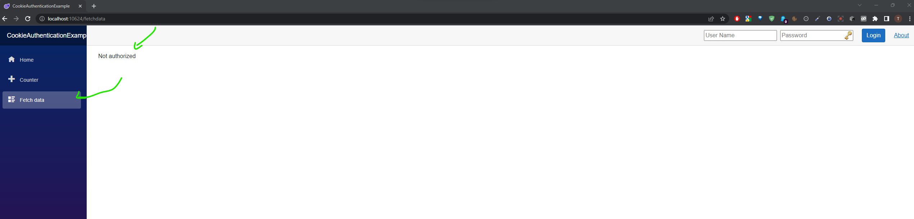
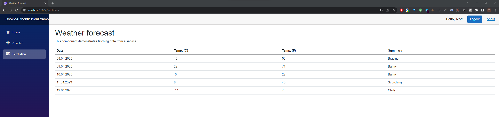

# Blazor Cookie Authentification Example

Prototype in Blazor Server with cookie authentication.


## Features

- Login Control displayed on every page
- Login & Logout Functionality
- Claim Management
- After inactivity of 30 sec, user will be logged out automatically


## Demo

- Weather forecast is protected if not authorized
- Counter page is based on the claim "Admin" (does not exist! Dummy to show the functionality of the roles)
- Login control shows username if successfully logged in


## Screenshots

Unauthorized View on FetchData:



After successful login:




## Core Concepts

### Program.cs

```csharp

builder.Services.AddAuthentication(CookieAuthenticationDefaults.AuthenticationScheme)
    .AddCookie(options =>
    {
        options.ExpireTimeSpan = TimeSpan.FromMinutes(5);
        options.SlidingExpiration = true;
        options.AccessDeniedPath = "/Forbidden";
        options.LoginPath = "/login";

    });
builder.Services.AddSingleton<IHttpContextAccessor, HttpContextAccessor>();

var cookiePolicyOptions = new CookiePolicyOptions
{
    MinimumSameSitePolicy = SameSiteMode.Strict,
};
app.UseCookiePolicy(cookiePolicyOptions);


app.UseAuthorization();
app.UseAuthentication();
```

### Login Control

```csharp
//use authorizedView and unauthorized View
'Encrpypt' UserName & Password in query parameter

```

### Login.cshtml
Code Behind is used for setting cookiePolicyOptions
```csharp
public async Task<IActionResult> OnGetAsync(string paramUsername, string paramPassword)
		{
			string returnUrl = Url.Content("~/");
			try
			{
				// Clear the existing external cookie
				await HttpContext.SignOutAsync(CookieAuthenticationDefaults.AuthenticationScheme);
			}
			catch { }


			//TODO check paramUserName & paramPassword in DB
			
			var claims = new List<Claim>
			{
				new Claim(ClaimTypes.Name, paramUsername),
				new Claim(ClaimTypes.Role, "Administrator"),
			};
			var claimsIdentity = new ClaimsIdentity(claims, CookieAuthenticationDefaults.AuthenticationScheme);
			var authProperties = new AuthenticationProperties
			{
				IsPersistent = true,
				RedirectUri = this.Request.Host.Value
			};
			try
			{
				await HttpContext.SignInAsync(CookieAuthenticationDefaults.AuthenticationScheme, new ClaimsPrincipal(claimsIdentity), authProperties);
			}
			catch (Exception ex)
			{
				string error = ex.Message;

			}
			return LocalRedirect(returnUrl);
		}
```


### Weather Forecast
Use Authentification for View
```csharp
//FetchData.razor
@page "/fetchdata"
@using CookieAuthenticationExample.Data
@inject WeatherForecastService ForecastService

@attribute [Authorize]      //This is important!

<PageTitle>Weather forecast</PageTitle>

<h1>Weather forecast</h1>

```

### Counter (Role Authentification)
```csharp
//Counter.razor
@page "/counter"

@attribute [Authorize(Roles = "Admin")]   // This is important - only visible if claim role contains admin

<PageTitle>Counter</PageTitle>

<h1>Counter</h1>

```


